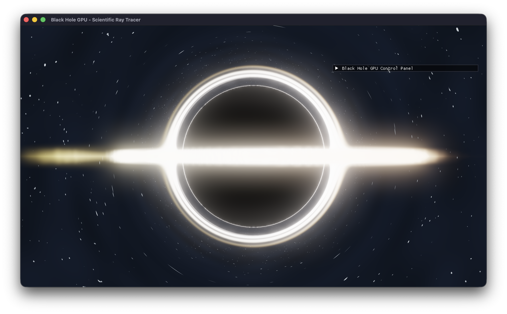

# Black Hole GPU Ray Tracer

A real-time, scientifically accurate black hole visualization using GPU-accelerated ray tracing on macOS with Metal.



## Features

### Scientific Accuracy
- **Schwarzschild Metric**: Proper general relativistic geodesic integration
- **RK4 Integration**: 4th-order Runge-Kutta for accurate light path calculation
- **Gravitational Lensing**: Einstein ring and photon sphere effects
- **Relativistic Effects**:
  - Gravitational redshift (frequency shift from gravity)
  - Doppler shift (motion-based color changes)
  - Relativistic beaming (intensity boost from motion)
  - Accurate temperature-based blackbody radiation

### Visual Features
- **Accretion Disk**: Physically-based temperature gradients (1000K-40000K)
- **Keplerian Rotation**: Differential shear with r^-3/2 orbital velocity profile for realistic disk dynamics
- **Azimuthal Banding**: Dual-frequency spiral lanes (12-24 and 5-11 modes) creating turbulent structure
- **Relativistic Lane Enhancement**: Doppler-driven brightness asymmetry amplifying approaching-side features
- **Micro-Turbulence Detail**: 18× high-frequency noise layer for fine-grained particle structure
- **Photon Ring Flare**: 1.8× lensing-enhanced emission near ISCO with view-dependent modulation
- **Animated Starfield**: Time-evolving background stars with rotation (0.02 rad/s) and drift parallax
- **Blackbody Radiation**: Realistic color rendering from Wien's law
- **Procedural Turbulence**: Multi-octave simplex noise with advected rotation for disk dynamics
- **Rossning Visual Presets**: One-click looks inspired by rossning92/Blackhole with tuned bloom and tone mapping
  - **Default**: Balanced appearance with moderate turbulence and bloom
  - **Particle Storm**: High-energy look with intense structure and prominent bloom
  - **Minimal Bloom**: Clean visualization emphasizing physical detail
- **HDR Bloom Pipeline**: Adjustable highlight threshold, blur iterations (1-8), and strength for cinematic glow
- **ACES Tone Mapping**: Toggle filmic tone mapping and dial gamma correction (1.0 - 4.0)

### Performance Optimization
- **Quality Presets**: Low/Medium/High/Ultra (2-6x FPS improvement)
  - Low: 30-60 FPS (128 iterations, fast preview)
  - Medium: 20-30 FPS (192 iterations, balanced)
  - High: 12-20 FPS (256 iterations, good quality)
  - Ultra: 8-15 FPS (512 iterations, maximum quality)
- **Adaptive Ray Marching**: Automatic step size adjustment near event horizon
- **Configurable Parameters**: Fine-tune iterations, step size, and quality
- **Real-time FPS Counter**: Monitor performance with ms/frame display

### Interactive Controls
Modern tabbed interface with organized controls:

**Physics Tab**:
- Gravity strength (0.1 - 10.0)
- Disk radius (1.0 - 20.0 Schwarzschild radii)
- Disk thickness (0.01 - 2.0)
- Event horizon size (0.01 - 1.0)
- Quick presets: Gargantua, Extreme Gravity, Thin Disk

**Visual Tab**:
- Rossning visual preset selector (Default / Particle Storm / Minimal Bloom)
- Accretion disk controls (density falloff, emission strength, turbulence, color mix)
- Background redshift toggle
- Background Doppler shift toggle
- Bloom controls (enable, strength, highlight threshold, quality/iterations)
- Tone mapping controls (enable toggle with gamma slider 1.0 - 4.0)
- Orbiting star controls (radius, speed, brightness)
- Advanced rendering settings (iterations, step size, adaptive stepping)

**Camera Tab**:
- Camera distance from black hole (3.0 - 20.0)
- Observer position (X, Y, Z coordinates)
- Observer velocity (for Doppler calculations)
- Reset to default button

**Recording Tab**:
- macOS screen recording instructions (Cmd+Shift+5)
- QuickTime screen capture guide
- Screenshot shortcuts (Cmd+Shift+4)
- Built-in video recording (coming soon)

## System Requirements

- **macOS**: 10.15 (Catalina) or later
- **Hardware**: Any Mac with Metal support
  - Apple Silicon (M1/M2/M3/M4 Pro) - Recommended (30-60 FPS on High)
  - Intel Macs with discrete GPU (15-30 FPS on Medium)
  - Intel Macs with integrated GPU (8-15 FPS on Low)
- **Development**:
  - Xcode 12+ with Metal support
  - CMake 3.15+
  - C++17 compiler

## Quick Start

### Using CMake (Recommended)

```bash
# Clone the repository
git clone https://github.com/SirArthurNerdolot1/BlackHoleGPU.git
cd BlackHoleGPU

# Create build directory
mkdir build && cd build

# Configure and build
cmake ..
cmake --build . --config Debug

# Run the application
open Debug/BlackHole.app
```

### Using Xcode

```bash
# Generate Xcode project
cmake -B build -G Xcode

# Open in Xcode
open build/BlackHoleGPU.xcodeproj
```

Then build and run from Xcode (⌘R).

### One-Line Build

```bash
# Automated build and run
./install.sh
```

## Usage Guide

### Getting Started

1. **Launch the app** - You'll see the black hole with default "Gargantua" settings
2. **Adjust quality** - Use the Quality Preset dropdown for your hardware:
   - **Low**: Maximum FPS for smooth interaction
   - **High**: Best balance of quality and performance (recommended)
   - **Ultra**: Maximum quality for screenshots/recordings
3. **Explore parameters** - Use the tabbed interface to adjust physics and visuals

### Quality Presets Comparison

| Preset | Iterations | FPS (M4 Pro) | FPS (Intel i7) | Use Case |
|--------|-----------|--------------|----------------|----------|
| Low    | 128       | 30-60        | 15-25          | Real-time interaction |
| Medium | 192       | 20-30        | 12-18          | General use |
| High   | 256       | 12-20        | 8-12           | Recommended default |
| Ultra  | 512       | 8-15         | 4-8            | Screenshots/video |

### Quick Presets

Try these preset buttons in the Physics tab:

- **Gargantua (Interstellar)**: Classic movie appearance
  - Gravity: 2.5, Disk Radius: 5.0 Rs, Thickness: 0.2
  
- **Extreme Gravity**: Maximum lensing effects
  - Gravity: 8.0, Disk Radius: 15.0 Rs, Thickness: 0.5
  
- **Thin Disk**: Minimal thickness for clean visuals
  - Gravity: 3.0, Disk Radius: 10.0 Rs, Thickness: 0.05

### Advanced Tips

- **Viewing Angles**: Adjust observer Y position (0-5) to see disk from different angles
- **Performance**: Lower quality preset if FPS drops below 10
- **Screenshots**: Set quality to Ultra before capturing (Cmd+Shift+4)
- **Recording**: Use macOS screen recording (Cmd+Shift+5) with Ultra quality
- **Post-Processing**: In the Visual tab, increase Bloom Quality (iterations) for softer glow, tweak strength/threshold, and fine-tune ACES tone mapping with the Gamma slider

## Physics Implementation

### Geodesic Integration

The black hole simulation uses the Schwarzschild metric in natural units (G = M = c = 1). Light rays are integrated using the RK4 method:

```
d²xᵘ/dλ² + Γᵘᵥᵨ (dxᵥ/dλ)(dxᵨ/dλ) = 0
```

Where Γᵘᵥᵨ are the Christoffel symbols for the Schwarzschild metric.

### Relativistic Effects

1. **Gravitational Redshift**:
   ```
   z = √(1 - rₛ/r) - 1
   ```

2. **Doppler Shift**:
   ```
   f_observed = f_emitted × γ(1 + β·n̂)
   ```

3. **Relativistic Beaming**:
   ```
   I_observed = I_emitted × D³
   ```
   where D is the Doppler factor.

### Accretion Disk Model

The accretion disk uses a sophisticated multi-layered rendering approach:

#### Keplerian Rotation
Material orbits at physically correct velocities following Kepler's third law:
```
ω(r) ∝ r⁻³/²
```
This creates differential shear where inner regions rotate much faster than outer regions, producing realistic swirling patterns in the turbulent structure.

#### Azimuthal Lane Structure
Dual-frequency sinusoidal modulation creates spiral lanes that evolve over time:
- **Primary frequency**: 12-24 modes (higher near ISCO)
- **Secondary frequency**: 5-11 modes (counter-rotating)
- **Result**: Complex interference patterns resembling magnetorotational instability

#### Relativistic Enhancement
Three layers of physical effects combine to create asymmetric brightness:
1. **Doppler beaming**: D³ intensity boost on approaching side
2. **Lane amplification**: Tangent-direction modulation (up to 2.5× on approaching side)
3. **Lensing flare**: 1.8× boost near photon ring (r ≈ 1.5 Rₛ)

#### Multi-Scale Turbulence
```
noise(r, θ, z, t) = Σᵢ (1/2ⁱ) · simplex(2ⁱ r, ωᵢ t) × microDetail(18× scale)
```
The micro-detail layer adds fine-grained particle structure at 18× the base noise frequency.

#### Temperature Profile
```
T(r) = T₀ × r⁻⁰·⁷⁵
```

Colors are computed from blackbody radiation with Wien's displacement law.

## Performance

### Benchmarks (1280x720 resolution)

| Hardware | Quality | FPS | Frame Time |
|----------|---------|-----|------------|
| M4 Pro | Low | 40-60 | 16-25 ms |
| M4 Pro | Medium | 25-35 | 28-40 ms |
| M4 Pro | High | 15-22 | 45-65 ms |
| M4 Pro | Ultra | 9-14 | 70-110 ms |
| Intel i7 (discrete) | Low | 20-35 | 28-50 ms |
| Intel i7 (discrete) | Medium | 12-20 | 50-83 ms |
| Intel i7 (discrete) | High | 8-14 | 70-125 ms |
| Intel i7 (integrated) | Low | 12-20 | 50-83 ms |

### Performance Optimization Features

1. **Adaptive Ray Marching**: Automatically reduces step size near event horizon where spacetime curvature is extreme
2. **Early Exit Conditions**: 
   - Terminates ray at event horizon (r < 1.0)
   - Exits when pixel becomes opaque (alpha < 0.01)
   - Stops when ray escapes to infinity (r > 100.0)
3. **Quality Presets**: Pre-configured settings for different hardware capabilities
4. **Configurable Iterations**: Range from 64 to 1024 (default: 256 on High)
5. **Variable Step Size**: Adjust from 0.05 to 0.2 (smaller = more accurate but slower)

### Optimization Tips

- **For Apple Silicon**: Use High or Ultra quality for best visuals
- **For Intel Integrated**: Stick to Low or Medium quality
- **For Screenshots**: Switch to Ultra temporarily
- **For Real-time Interaction**: Use Low quality while adjusting parameters
- **Monitor FPS**: Use the built-in FPS counter to ensure smooth performance (aim for >15 FPS)

## Project Structure

```
BlackHoleGPU/
├── CMakeLists.txt              # Build configuration
├── README.md                   # This file
├── QUICKSTART.md              # Quick start guide
├── FEATURES_V2.md             # Detailed feature documentation
├── PACKAGE_SUMMARY.md         # Package and deployment info
├── LICENSE                    # MIT License
├── src/
│   ├── main.cpp              # Application entry point (GLFW setup)
│   ├── Renderer.hpp          # Renderer interface (C++ header)
│   ├── Renderer.mm           # Metal renderer implementation (Obj-C++)
│   └── ShaderTypes.h         # Shared CPU/GPU data structures
├── shaders/
│   └── BlackHole.metal       # Metal compute shader (main physics)
└── vendor/
    ├── glfw/                 # Windowing library (cross-platform)
    ├── glm/                  # GLM math library (vectors, matrices)
    ├── imgui/                # ImGui immediate mode GUI
    └── metal-cpp/            # Metal C++ wrapper (Apple)
```

### Key Files

- **`src/Renderer.mm`**: Main rendering engine
  - ImGui interface with 4 tabs
  - Metal device and pipeline setup
  - Performance tracking (FPS counter)
  - Quality preset management
  
- **`shaders/BlackHole.metal`**: GPU compute shader
  - RK4 geodesic integration
  - Accretion disk rendering
  - Relativistic effects (redshift, Doppler, beaming)
  - Background starfield
  - Adaptive ray marching
  
- **`src/ShaderTypes.h`**: Uniforms structure
  - Physics parameters (gravity, disk size, etc.)
  - Observer state (position, velocity)
  - Performance settings (quality, iterations, step size)
  - Visual toggles (redshift, Doppler, orbiting star)

## Credits

### Original Implementation
- **[BlackHoleRayTracer](https://github.com/hydrogendeuteride/BlackHoleRayTracer)** by hydrogendeuteride
  - Original OpenGL implementation
  - Schwarzschild metric physics
  - Geodesic integration algorithms
  - Accretion disk model

### macOS Metal Port
- **Metal Implementation**: Complete rewrite for Apple's Metal API
- **Performance Optimization**: Quality presets, adaptive ray marching, FPS tracking
- **Modern UI**: ImGui tabbed interface with tooltips and organized controls
- **Enhanced Features**: Observer controls, orbiting star, advanced physics toggles

### Libraries
- **GLFW**: Cross-platform window management and input
- **ImGui**: Immediate mode graphical user interface library
- **GLM**: OpenGL Mathematics (vectors, matrices, quaternions)
- **Metal-cpp**: Apple's C++ interface to Metal API

### Scientific References
- [Interstellar's Black Hole Visualization](https://arxiv.org/abs/1502.03808) - Oliver James et al.
- [Schwarzschild Metric](https://en.wikipedia.org/wiki/Schwarzschild_metric) - Karl Schwarzschild (1916)
- [Accretion Disk Physics](https://en.wikipedia.org/wiki/Accretion_disk) - Shakura-Sunyaev model
- [General Relativity](https://en.wikipedia.org/wiki/General_relativity) - Albert Einstein (1915)
- [Geodesic Equations](https://en.wikipedia.org/wiki/Geodesics_in_general_relativity) - Light ray propagation

## License

MIT License - See [LICENSE](LICENSE) file for details.

**Original Physics**: hydrogendeuteride (BlackHoleRayTracer)  
**Metal Port & Enhancements**: Contributors to this repository

## Contributing

Contributions are welcome! Here are some areas for improvement:

### High Priority
- **Kerr Metric**: Rotating black holes (frame dragging, ergosphere)
- **Video Recording**: Built-in Metal texture capture to video file
- **Photon Sphere Visualization**: Enhanced bright ring at r=1.5Rs
- **Multiple Black Holes**: Binary systems and gravitational interactions

### Medium Priority
- **Advanced Disk Models**: Optically thin disks, jets, coronae
- **VR Support**: Immersive black hole visualization
- **Neutron Stars**: Pulsar visualization with beaming
- **Wormholes**: Traversable wormhole geometry

### Low Priority
- **Lens Flare**: Artistic enhancement for bright regions
- **Particle System**: Matter falling into black hole
- **Time Dilation Visualization**: Real-time clock comparison
- **Educational Mode**: Physics explanations and annotations

### How to Contribute

1. Fork the repository
2. Create a feature branch (`git checkout -b feature/AmazingFeature`)
3. Commit your changes (`git commit -m 'Add some AmazingFeature'`)
4. Push to the branch (`git push origin feature/AmazingFeature`)
5. Open a Pull Request

Please ensure:
- Code follows existing style and conventions
- Physics implementations are scientifically accurate
- Performance impact is documented
- UI changes maintain clean, intuitive interface

## Contact

For questions, bug reports, or feature requests:
- **GitHub Issues**: [Open an issue](https://github.com/SirArthurNerdolot1/BlackHoleGPU/issues)
- **Discussions**: Share ideas and ask questions in GitHub Discussions

## Gallery

*Add your screenshots here!*

Show us your best black hole renderings by opening a PR with images added to a `gallery/` folder.

---

<div align="center">

*"The black hole teaches us that space can be crumpled like a piece of paper into an infinitesimal dot, that time can be extinguished like a blown-out flame, and that the laws of physics that we regard as 'sacred,' as immutable, are anything but."*  
**— John Wheeler**

</div>
